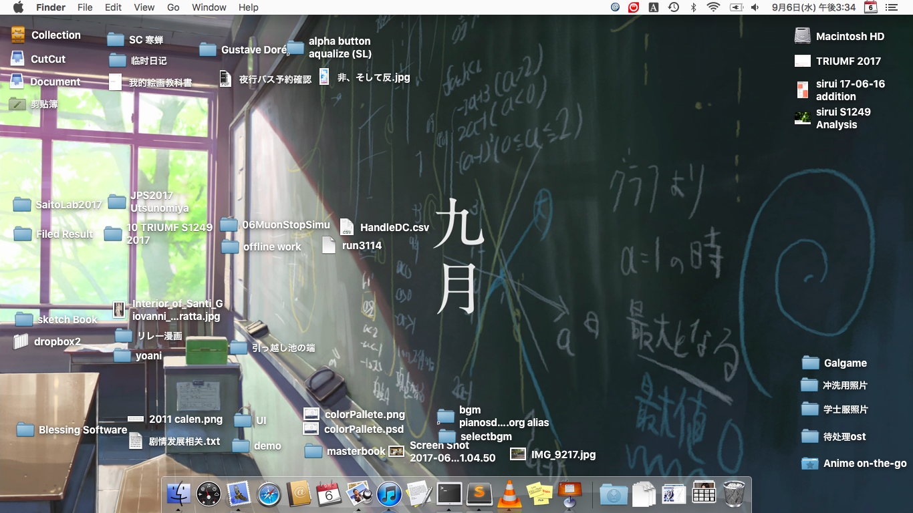
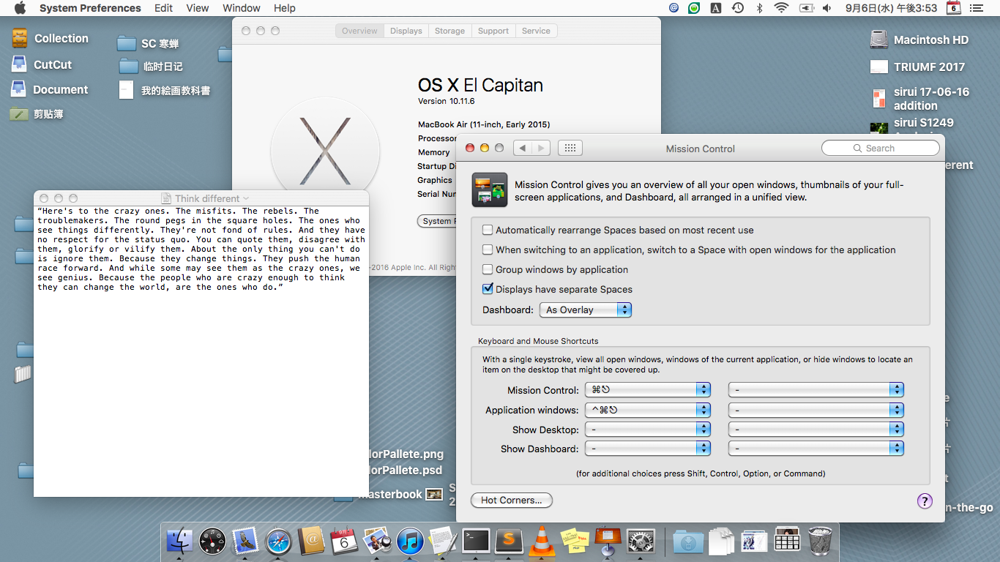
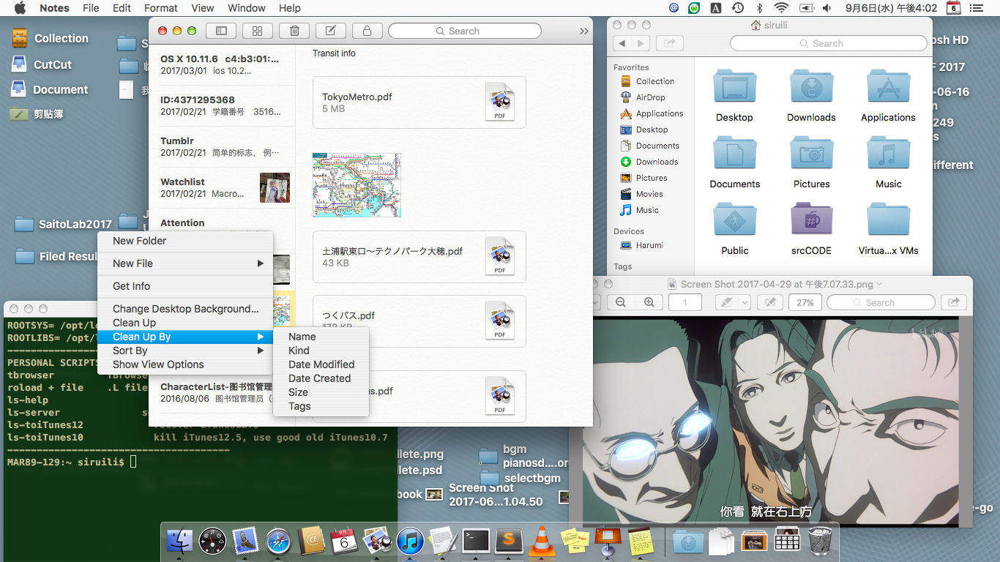
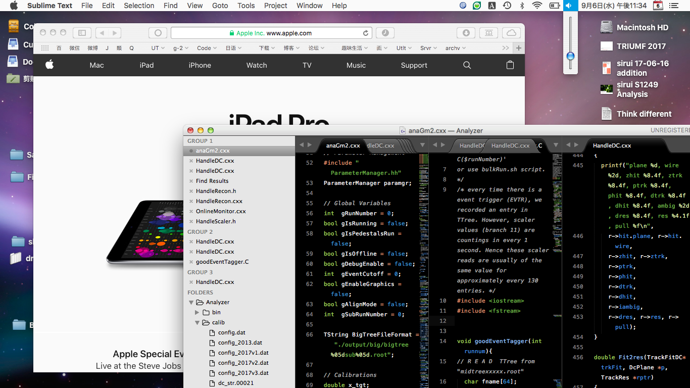

## Notice
It is an uncomplete project. There are still some places left undone.

## How to install
The main files are those .car file in `Resource-alpha` or `Resource-stable`. Search "Theme engine" for how to install them.

Many other icon/png/tiff need to be replaced mannually:

`/System/Library/CoreServices/SystemAppearance.bundle/Contents/Resources`

`/System/Library/CoreServices/CoreTypes.bundle`

`/System/Library/Input Methods/`

`/System/Library/PreferencePans/`

`/System/Library/PrivateFrameworks/CalendarUI/`

`/System/Library/CoreServices/Menu Extras`

`/System/Library/PrivateFrameworks/CoreWLANKit.framework/Versions/A/Resources/Assets.car`

## Preview

## Developing Note
AccessibilityAppearance.car: 打开辅助功能后的增加对比度之后的UI

